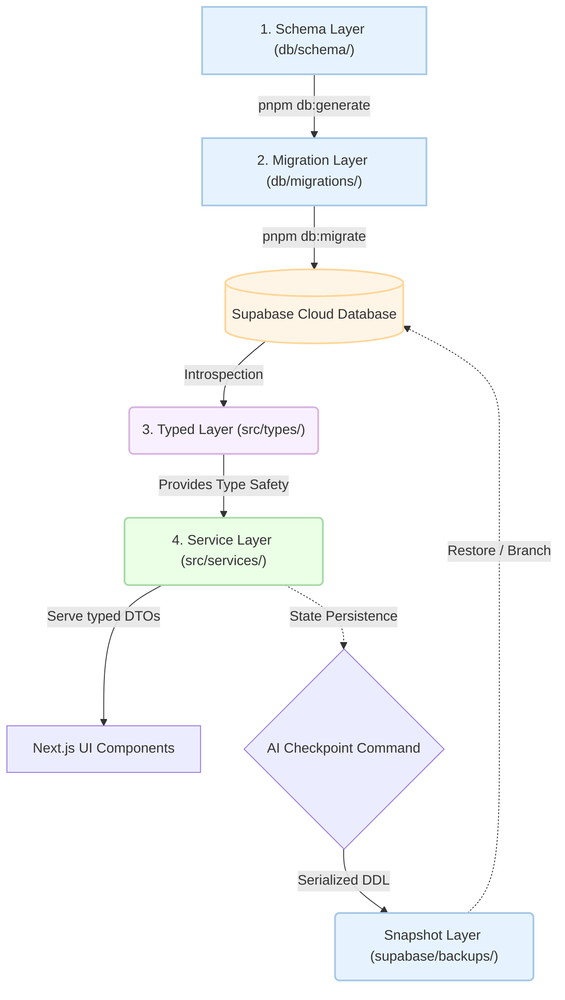

# The DannFlow "Holy Trinity" Architecture

DannFlow follows a strict **Separation of Concerns** model designed to maximize AI-human collaboration and maintain high system velocity.

### 🏗️ Architectural Pattern

---

### 1. The Schema Layer (`db/schema/`)
- **Software Engineering Concept**: **Schema as Code**
- **Definition**: Drizzle TypeScript table definitions for app-owned tables, columns, indexes, and relations.
- **Role**: This is the source of truth for normal schema changes. Agents edit this layer first, then run `pnpm db:generate`.

### 2. The Migration Layer (`db/migrations/`)
- **Software Engineering Concept**: **Reviewed Change History**
- **Definition**: SQL generated from `db/schema/*.ts`, with explicit hand-authored SQL for Supabase-specific features such as RLS policies, auth triggers, functions, storage buckets, extensions, and grants.
- **Role**: This layer is what gets applied to Supabase through `pnpm db:migrate`. Review it before it touches a live project.

### 3. The Typed Layer (`src/types/`)
- **Software Engineering Concept**: **Schema Mirroring**
- **Definition**: A static representation of the dynamic database schema.
- **Role**: This layer acts as the "Eyes" of the AI. `pnpm db:migrate`, `pnpm db:types`, or `pnpm db:types:remote` refreshes it from the actual Supabase database.

### Snapshot Layer (`supabase/backups/`)
- **Software Engineering Concept**: **Version-Controlled State**
- **Definition**: Timestamped DDL (Data Definition Language) exports.
- **Role**: This is the live-state checkpoint for disaster recovery and drift audits. It is not the normal source of schema changes.

### 4. The Service Layer (`src/services/`)
- **Software Engineering Concept**: **Domain Logic Isolation**
- **Definition**: Pure asynchronous functions that encapsulate data fetching and business rules.
- **Role**: This is the "Action" layer. UI components must remain "dumb" and only focus on presentation. All logic, from row filtering for RLS to complex aggregations, must happen here to ensure maintainability and testability.

### 🛡️ Security Protocol (RLS Awareness)
Every developer and agent working on DannFlow must adhere to the RLS Constraint: **Queries must always include current user context**. By default, services are designed to fail-safe unless an explicit `userId` filter is provided.
